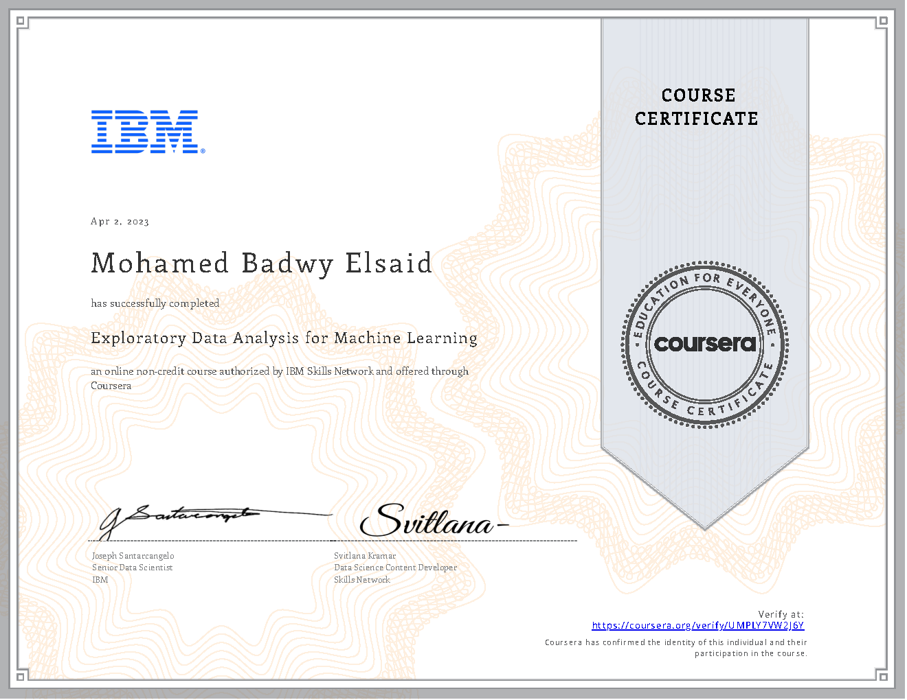

# Exploratory-Data-Analysis-for-Machine-Learning

This Repository contains Notebooks for [Exploratory Data Analysis for Machine Learning](https://www.coursera.org/learn/ibm-exploratory-data-analysis-for-machine-learning) Course from Coursera.

This repo is for my personal reference.

Try to do the assignments by your own. Use these as a reference material if you are stuck in the assignments.

## Certificate

